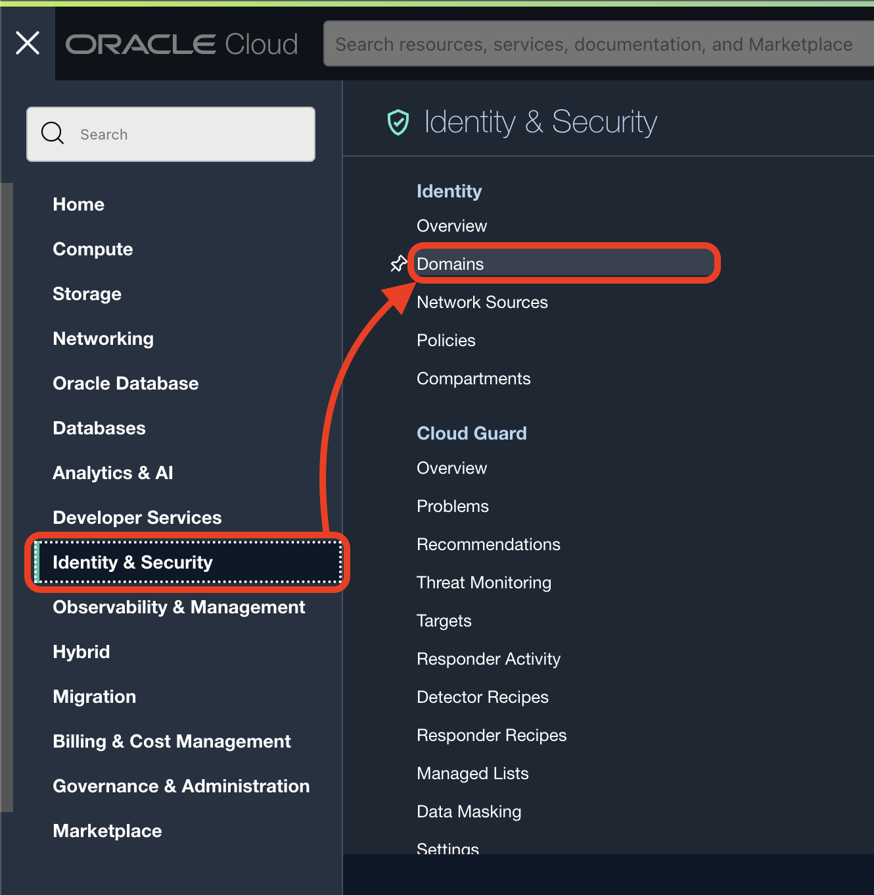
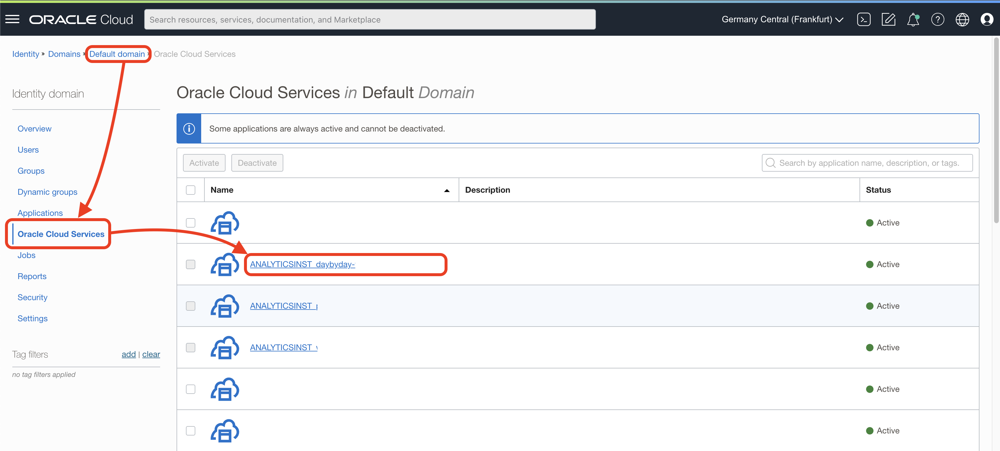
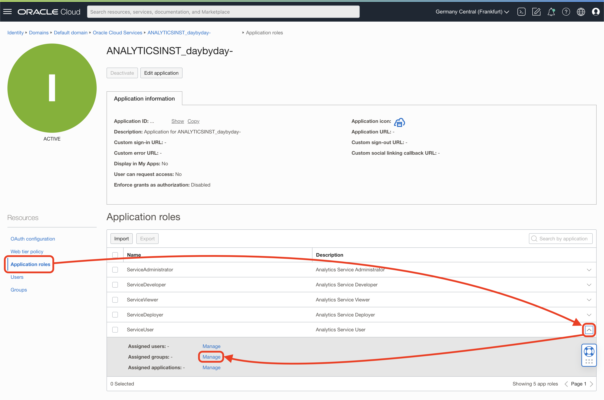

# OAC Application Role next steps

[Back](./README.md)

Go to **Menu** >> **Identity & Security** > **Domains**:

Select the Default domain.

Click on the side menu on **Oracle Cloud Services** and then on the Analytics Instance you want:

Click on the side menu on **Application roles**, drill down on **ServiceUser** and click on **Manage**:

Click on **Show available groups** and select your group. Click **Assign**.

Finally, close the pop up.

[Back](./README.md)