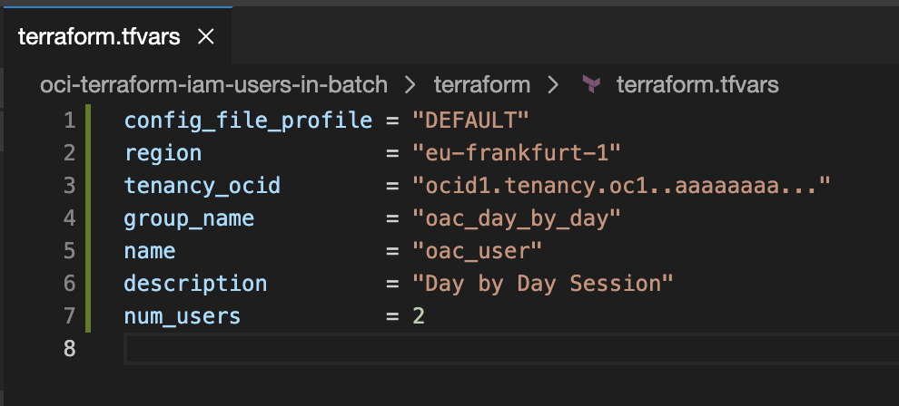
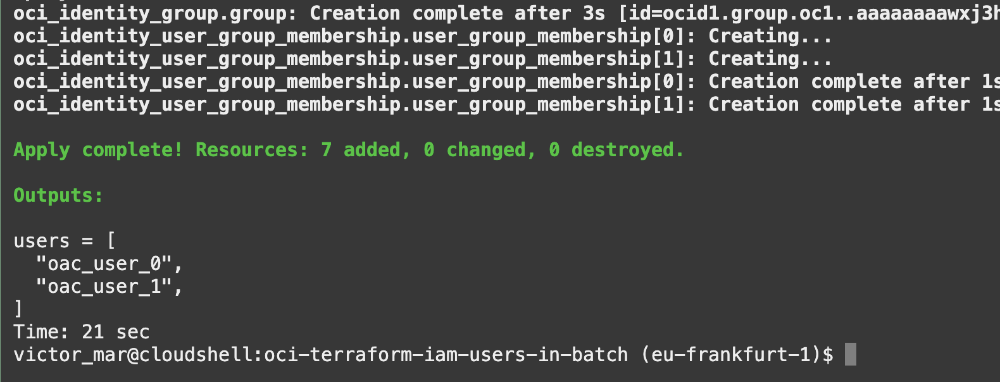
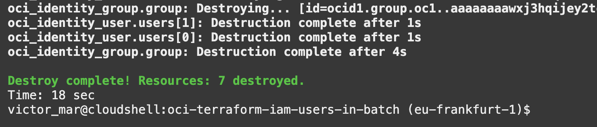

# OCI IAM users creation in Batch with Terraform

This repository is for creating:
- A bunch of IAM Users (no capabilities).
- An IAM group.

## Create Users

On **Cloud Shell**, clone the repository.
```
git clone https://github.com/vmleon/oci-terraform-iam-users-in-batch.git
```

Change directory to the repository
```
cd oci-terraform-iam-users-in-batch
```

Copy the `terraform.tfvars.template`
```
cp terraform/terraform.tfvars.template terraform/terraform.tfvars
```

Edit in **Code Editor** the `terraform.tfvars`

> Get the values with the following commands
> 
> ```
> echo $OCI_REGION
> ```
> 
> ```
> echo $OCI_TENANCY
> ```

It will look like this:


Run the script to start
```
./start.sh
```

After the creation you will see the list of user names created:


> NOTE: Creating users for Oracle Analytics Cloud?
>
> Go to [OAC Application Role next steps](OAC.md)

## Delete Users

Run the script to destroy the users
```
./stop.sh
```

After the destruction you will see the this message:

